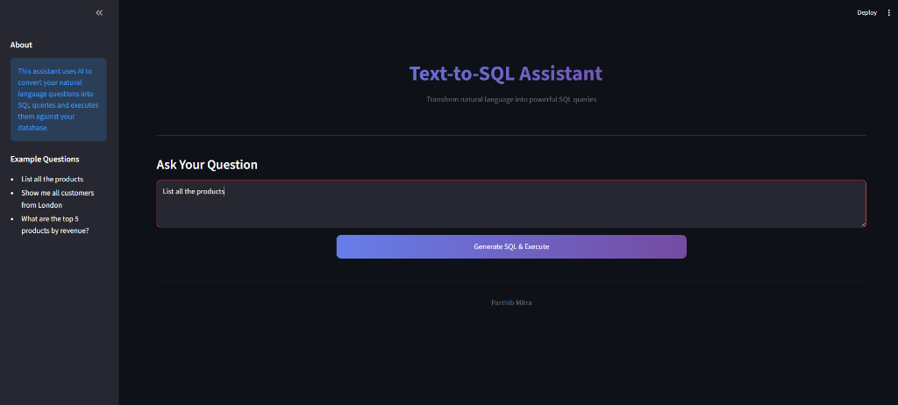
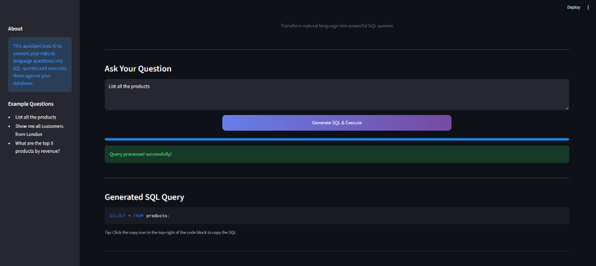
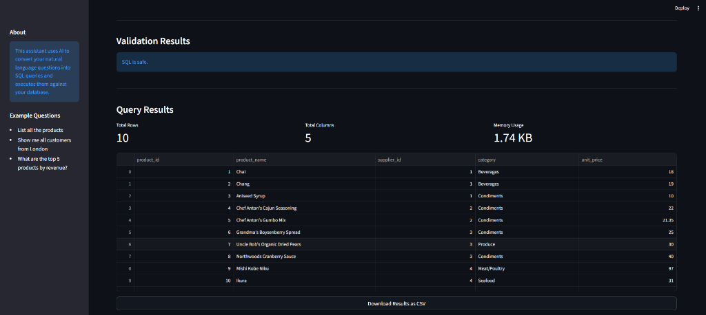

# 🤖 Text-to-SQL Assistant

An intelligent application that transforms natural language questions into executable SQL queries, runs them against your database, and visualizes the results. Built with OpenAI, ChromaDB, and Streamlit.

## ✨ Features

- **Natural Language Processing**: Convert English questions into complex SQL queries using GPT-4.
- **Schema-Aware**: Uses ChromaDB to retrieve relevant table schemas, ensuring accurate query generation.
- **Safety First**: Includes a critic agent to validate SQL and prevent dangerous operations (DROP, DELETE, etc.).
- **Interactive UI**: A modern, responsive interface built with Streamlit.
- **Data Visualization**: View query results in an interactive table and download them as CSV.

## 📸 Screenshots

### 1. Home Screen
Ask questions in plain English.


### 2. SQL Generation
View the generated SQL query and validation status.


### 3. Query Results
See the results of your query and download them.


## 🛠️ Tech Stack

- **Frontend**: [Streamlit](https://streamlit.io/)
- **LLM**: [OpenAI GPT-4o-mini](https://openai.com/)
- **Vector Store**: [ChromaDB](https://www.trychroma.com/)
- **Database**: MySQL
- **Language**: Python 3.10+

## 🚀 Getting Started

### Prerequisites

- Python 3.8 or higher
- MySQL Server
- OpenAI API Key

### Installation

1. **Clone the repository**
   ```bash
   git clone <repository-url>
   cd text_to_sql
   ```

2. **Create a virtual environment**
   ```bash
   python -m venv venv
   # Windows
   .\venv\Scripts\activate
   # Mac/Linux
   source venv/bin/activate
   ```

3. **Install dependencies**
   ```bash
   pip install -r requirements.txt
   ```

4. **Set up Environment Variables**
   Create a `.env` file in the root directory:
   ```env
   OPENAI_API_KEY=your_openai_api_key
   MYSQL_HOST=localhost
   MYSQL_PORT=3306
   MYSQL_USER=root
   MYSQL_PASSWORD=your_password
   MYSQL_DATABASE=texttosql2
   ```

5. **Initialize Database**
   Run the schema script to create tables and sample data in your MySQL database:
   ```bash
   # You can use a tool like MySQL Workbench or run via command line
   mysql -u root -p < schema.sql
   ```

6. **Build Schema Index**
   Index your database schema into ChromaDB for the retriever:
   ```bash
   python build_schema_store.py
   ```

### Usage

Run the Streamlit application:
```bash
python -m streamlit run app.py
```

Open your browser at `http://localhost:8501` and start asking questions!

## 📂 Project Structure

```
text_to_sql/
├── agents/                 # AI Agents
│   ├── orchestrator.py    # Main logic flow
│   ├── retriever.py       # Schema retrieval
│   ├── sql_generator.py   # SQL generation
│   ├── critic.py          # SQL validation
│   └── sql_executor.py    # Database execution
├── assets/                 # Images and static assets
├── data/                   # Data scripts
├── utils/                  # Utility functions
├── app.py                  # Streamlit frontend
├── build_schema_store.py   # Schema indexing script
├── schema.sql              # Database schema
└── requirements.txt        # Dependencies
```

## 🤝 Contributing

Contributions are welcome! Please feel free to submit a Pull Request.
